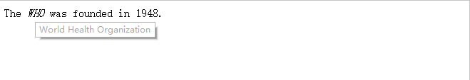

HTML `<dfn>` 元素定义项目或缩写的定义。

`<dfn>` 的用法，按照 HTML5 标准中的描述，有两种使用方式：

1. 如果设置了 `<dfn>` 元素的 `title` 属性，则定义项目：

```html
<p>The <dfn title="World Health Organication">WHO</dfn> was founded in 1948.</p>
```

运行结果：



2. 如果 `<dfn>` 元素包含具有标题的 `<abbr>` 元素，则 `title` 定义项目：

```html
<p>The <dfn><abbr title="World Health Organication">WHO</abbr></dfn> was founded in 1948.</p>
```

运行结果：


