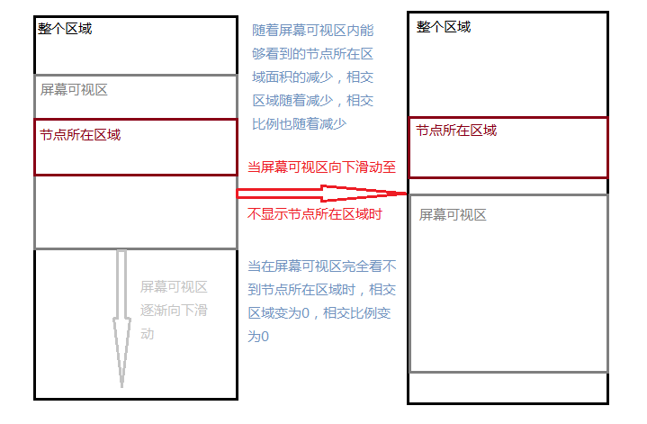

小程序中提供一个API可以判断页面布局中某一个给定 id 或者 class 的节点组件在页面中的展示情况，官方文档说明如下：

> 节点布局交叉状态API可用于监听两个或多个组件节点在布局位置上的相交状态。这一组API常常可以用于推断某些节点是否可以被用户看见、有多大比例可以被用户看见。
>
> 这一组API涉及的主要概念如下。
    参照节点：监听的参照节点，取它的布局区域作为参照区域。如果有多个参照节点，则会取它们布局区域的 交集 作为参照区域。页面显示区域也可作为参照区域之一。
    目标节点：监听的目标，默认只能是一个节点（使用 selectAll 选项时，可以同时监听多个节点）。
    相交区域：目标节点的布局区域与参照区域的相交区域。
    相交比例：相交区域占参照区域的比例。
    阈值：相交比例如果达到阈值，则会触发监听器的回调函数。阈值可以有多个。

较难理解的是相交比例的概念，下面引入两个情况：
1. 未指定参照节点，节点相对于屏幕可视区域布局：这个时候的相交区域即为该节点在整个布局中的区域，见下图说明：
  
  相关代码示例如下：

```javascript
  Page({
    onLoad: function()
      wx.createIntersectionObserver()
        .relativeToViewport()
        .observe('.target-class', (res) => {
          res.id // 目标节点 id
          res.dataset // 目标节点 dataset
          res.intersectionRatio // 相交区域占目标节点的布局区域的比例
          res.intersectionRect // 相交区域
          res.intersectionRect.left // 相交区域的左边界坐标
          res.intersectionRect.top // 相交区域的上边界坐标
          res.intersectionRect.width // 相交区域的宽度
          res.intersectionRect.height // 相交区域的高度
        })
    }
  })
```

2. 制定目标界定（用选择器 `.target-class` 指定）和参照节点（用选择器 `.relative-class` 指定）：<br>
以下示例代码可以在目标节点与参照节点在页面显示区域内相交或相离，且相交或相离程度达到目标节点布局区域的 20% 和 50% 时，触发回调函数。示例代码如下：

```javascript
  Page({
    onLoad: function(){
      wx.createIntersectionObserver(this, {thresholds: [0.2, 0.5]})
        .relativeTo('.relative-class').relativeToViewport().observe('.target-class', (res) => {
          res.intersectionRatio // 相交区域占目标节点的布局区域的比例
          res.intersectionRect // 相交区域
          res.intersectionRect.left // 相交区域的左边界坐标
          res.intersectionRect.top // 相交区域的上边界坐标
          res.intersectionRect.width // 相交区域的宽度
          res.intersectionRect.height // 相交区域的高度
        })
    }
  })
```